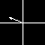

--------------------------------------------------------------------------------
STEPS TO RUN:
1. Clone Entire Project
2. You should see a pom.xml file, it has all dependencies. Right click on it, then click on Maven and then click on reimport.
3. Before running, please change paths in these places:

   a. IDX READER:
   src/main/java/Client/IdxReader : Lines 18,19,21,22
   /Users/sanaydevi/Desktop/hciai/project-03/faceEmotions/src/main/resources/train-images-idx3-ubyte
   should be renamed /local machine path/faceEmotions/src/main/resources/train-images-idx3-ubyte

 4. Now run SERVER, click RUN. For good images, increase values of thinking, concentration and agree( above 75%) and
 let values of disagree, unsure and frustate be below 10%.
 5. Now run Client, click Connect.
 6. After few minutes, stop RUN ON SERVER FIRST and then click Disconnect on Client, your png images should be created.
 8. Now click on Predict, it will train the NN with (3050,1400) as parameters and predict the first image
 created by the values given in the Server. (you may have to click on Grey Space to see message.)
 9. Now if you want to check for other images, change the path in src/main/java/Client/ClientDemo line 616 : File image = new File("res/predictImage1.png"); to
 File image = new File("res/predictImage2.png") and so on. The number of images depend on how long you let the server and client run.

_____________________________________________________________________________________________________

Project-04: POINTS TO CONSIDER
1. IMPROVED SERVER SIDE UI: /res/serverUIFinal.png
2. DATA GENERATED FROM ONE SERVER AND PLOTTED
3. DATA FROM SKIN CONDUCTANCE RAN IN TAB AND INCLUDED IN CSV, HOWEVER DID NOT INCLUDE IT IN ANALYSIS for Neural Nets.
3. THE X-AXIS WAS TAKEN AS PLEASURE AND Y-AXIS AS AROUSAL, WE TRANSFORMED THE PIXEL COORDINATES TO GRAPH COORDINATES
USING A FORMULA. THE LINES YOU SEE ARE PLOTTED POINTS ON A GRAPH, WE REMOVED THE X-AXIS AND Y-AXIS SO THAT OUR NEURAL NET 
COULD TRAIN BETTER.

4. IMAGE GENEREATED IS OF PIXEL 50 * 50
5. WE GENERATED GOOD IMAGES : HIGH AGREE, HIGH CONCENTRATE, HIGH THINKING
6. WE GENERATED BAD IMAGES : HIGH DISAGREE, HIGH FRUSTATE, HIGH UNSURE
7. WE GENERATED OKAY IMAGES : ALL MIDDLE VALUES
7. TOTAL TRAINING IMAGES GENERATED = 3200, TOTAL TEST IMAGES GENERATED = 1500
8. THE IMAGE WERE THEN CONVERTED TO MNIST DATA SET FORMAT USING PYTHON CODE.
10. We Ran Our Neural Net, TEST SET ACCURACY WAS BETWEEN 0.87 AND 0.9.
